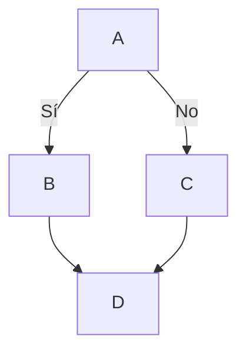

# Máster en Formación del Profesorado - 22/23
## Aprendizaje y Enseñanza de la Tecnología 
---


Alumno: **[Belén Herrera Giménez](https://campusdoctoradoyposgrado2223.ull.es/user/profile.php?id=917)** - [BelHerGi](https://github.com/BelHerGi)

Puedes enviarme un *correo* a `let email: str = "alu0101598581@ull.edu.es"`. Para consultar la mi experiencia en el Máster y un breve CV puedes pulsar [este enlace](master.md)

*Cita favorita:*
>A computer would deserve to be called intelligent if it could deceive a human into believing that it was human - Alan Turing


```javascript
<script type="text/javascript">
    function getfocus()
    {
            document.getElementById('w3s').focus();
    }
    
    function losefocus()
    {
            document.getElementById('w3s').blur();
    }

```


---

## Lista ordenada

1. Enero
2. Febrero
3. Marzo
4. Abril
5. Mayo
6. Junio
7. Julio
8. Agosto
9. Septiembre
10. Octubre
11. Noviembre
12. Diciembre

## Enlace

[Aula Virtual](https://campusdoctoradoyposgrado2223.ull.es/course/view.php?id=2223110052)

## Inline Code

En markdown una imagen se escribe así: `(texto explicativo)(logos/logo.png)`y este es un ejemplo de código inline

## Imagen


[*Seguir leyendo* ](mas-info.md)

---

**Enlaces de contacto**:

|      Redes Sociales       |                                                                                                                   |
| :-----------------------: | :---------------------------------------------------------------------------------------------------------------: |
|   LinkedIn :briefcase:    |               [](hhttps://www.linkedin.com/in/belen-herrera-gim%C3%A9nez-5443213a/)                |

---

|   Datos |  Contacto   |
|------|---------------|
| Telf | 660 095 713  |
| Mail | alu0101598581@ull.edu.es|

---

## Matemáticas

$$ x = \frac {-b \pm \sqrt {b^2 - 4ac}}{2a}$$

---

## Diagrama



